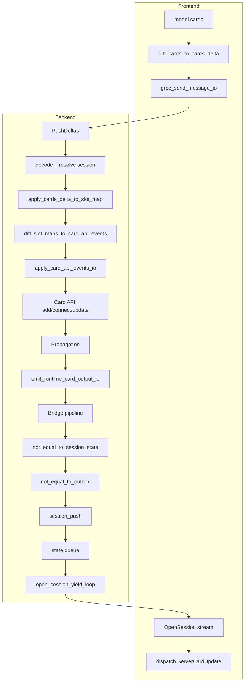

# Backend–Frontend Data Flow (Current)

Data flow from frontend diff → backend → card API → session bridge → OpenSession stream → frontend.  
**Echo is not yet fixed.** This doc identifies the pipeline and redundant parts to simplify.

---

## 1. Frontend → Backend (PushDeltas)

```
┌─────────────────────────────────────────────────────────────────────────────────┐
│  FRONTEND (lain-viz)                                                             │
├─────────────────────────────────────────────────────────────────────────────────┤
│  model.cards (ContextualizedCard[])                                              │
│       │                                                                          │
│       ▼                                                                          │
│  contextualized_cards_to_cards_delta$                                            │
│  • pairwise(prev, curr)                                                          │
│  • diff_cards_to_cards_delta(prev, curr, getServerSlots?)                        │
│  • getServerSlots filters out server-originated slots (echo prevention, partial) │
│       │                                                                          │
│       ▼                                                                          │
│  grpc_send_message_io(sessionRef, delta) → PushDeltas RPC                        │
└─────────────────────────────────────────────────────────────────────────────────┘
                                      │
                                      ▼
┌─────────────────────────────────────────────────────────────────────────────────┐
│  BACKEND (connect_server.ts)                                                     │
├─────────────────────────────────────────────────────────────────────────────────┤
│  push_deltas_apply_io                                                            │
│       │                                                                          │
│       ├─ decode_push_deltas_io(req) → { sessionId, delta }                       │
│       ├─ resolve_push_session_io(sessionId) → state (SessionState)               │
│       ├─ derive_push_transition(state.slotMap, delta)                            │
│       │     • nextSlotMap = apply_cards_delta_to_slot_map(delta, prev)           │
│       │     • events = diff_slot_maps_to_card_api_events(prev, nextSlotMap)      │
│       │                                                                          │
│       ├─ ensure_runtime_output_bridge_io(state)  ← bridge for Part B → queue     │
│       └─ apply_push_events_and_bind_io(env, state, transition)                   │
│             • apply_card_api_events_io(events)  → card API (add/connect/update)  │
│             • state.slotMap = nextSlotMap                                        │
│             • bind_context_slots_io(env, slotMap)                                │
│                                                                                  │
│  enqueue_push_messages_io  ← COMMENTED OUT (was echoing delta back)              │
└─────────────────────────────────────────────────────────────────────────────────┘
```

---

## 2. Backend Part B (Card API + Propagation)

```
┌─────────────────────────────────────────────────────────────────────────────────┐
│  apply_card_api_events_io (card_slot_sync.ts)                                    │
├─────────────────────────────────────────────────────────────────────────────────┤
│  events from diff: card_connect | card_detach | card_remove | card_update        │
│       │                                                                          │
│       ├─ card_connect → ensure_card_exists, connect_cards                        │
│       ├─ card_detach  → detach_cards_by_key                                      │
│       ├─ card_remove  → remove_card                                              │
│       └─ card_update  → add_card if missing, update_card (→ runtime_update_card) │
│                                                                                  │
│  update_card / connect_cards / etc. → propagation runs (execute_all_tasks)       │
└─────────────────────────────────────────────────────────────────────────────────┘
                                      │
                                      ▼
┌─────────────────────────────────────────────────────────────────────────────────┐
│  Part B: Propagation (schema.ts, runtime.ts)                                     │
├─────────────────────────────────────────────────────────────────────────────────┤
│  p_emit_card_internal_updates_to_runtime(cardId)(internal_content)               │
│  • Watches card's ::this cell                                                    │
│  • On change → emit_runtime_card_output_io({ cardId, slot: "::this", value })    │
└─────────────────────────────────────────────────────────────────────────────────┘
                                      │
                                      ▼
┌─────────────────────────────────────────────────────────────────────────────────┐
│  emit_runtime_card_output_io (card_runtime_events.ts)                            │
│  Global pub/sub; subscribers receive RuntimeCardOutputEvent                      │
└─────────────────────────────────────────────────────────────────────────────────┘
```

---

## 3. Bridge: Runtime Output → OpenSession Queue

```
┌─────────────────────────────────────────────────────────────────────────────────┐
│  Bridge (connect_bridge_minireactor.ts)                                          │
├─────────────────────────────────────────────────────────────────────────────────┤
│  subscribe_runtime_card_output(callback)                                         │
│  callback = bridge.receive_io(event)                                             │
│       │                                                                          │
│       ▼                                                                          │
│  create_runtime_output_bridge_io(state, trace_io)                                │
│  pipeline:                                                                       │
│    event → stage_from_event (key = cardId+slot, signature = base_value_signature)│
│         → filter(not_equal_to_session_state)  ← loop guard: skip if slotMap match │
│         → filter(not_equal_to_outbox)         ← temporal dedup                    │
│         → forward_to_session_io → session_push(state, CardUpdate)                │
│                                                                                  │
│  session_push pushes ServerMessage (CardUpdate) into state.queue                 │
└─────────────────────────────────────────────────────────────────────────────────┘
```

---

## 4. OpenSession Yield Loop → Frontend

```
┌─────────────────────────────────────────────────────────────────────────────────┐
│  open_session_yield_loop (connect_server.ts)                                     │
├─────────────────────────────────────────────────────────────────────────────────┤
│  while (!aborted) {                                                              │
│    hasMessage = await wait_for_message_or_timeout(state, HEARTBEAT_MS)           │
│    if (hasMessage && state.queue.length > 0) {                                   │
│      while (queue non-empty) yield state.queue.shift()  ← CardUpdate or Heartbeat│
│    } else {                                                                      │
│      yield to_heartbeat_message()                                                │
│    }                                                                             │
│  }                                                                               │
└─────────────────────────────────────────────────────────────────────────────────┘
                                      │
                                      ▼
┌─────────────────────────────────────────────────────────────────────────────────┐
│  Frontend: grpc_open_session_io                                                  │
│  for await (pb of stream) → decode_server_message → onServerMessage(msg)         │
│  dispatch: BackendHeartbeat | ServerCardUpdate { card_id, slot, ref }            │
└─────────────────────────────────────────────────────────────────────────────────┘
```

---

## 5. End-to-End Flow (Single Diagram)



---

## 6. Redundant / Problematic Parts

| Location | Issue | Notes |
|----------|-------|-------|
| **enqueue_push_messages_io** | Commented out | Was echoing `decoded.delta` as CardUpdates → frontend received what it sent. Correctly disabled. |
| **delta_to_server_messages** | Used only by Session (bidi) | Session route echoes delta back. OpenSession + PushDeltas do NOT use it. Not redundant for Session path. |
| **Double source of CardUpdates** | Bridge vs delta echo | Only Bridge should push to OpenSession queue. Delta echo (enqueue_push_messages_io) is off. |
| **getServerSlots (frontend)** | Partial echo fix | Frontend excludes server-originated slots from diff. If not wired or wrong, frontend may re-push what backend sent. |
| **Bridge loop guard** | not_equal_to_session_state | Compares emitted value to `state.slotMap[key]`. slotMap is updated by PushDeltas apply. If propagation produces same value user typed (e.g. code → compile → ::this), guard should skip. Key mismatch: `card-Xcode` (user) vs `card-X::this` (propagation) — different keys. |
| **sync_code_slots vs sync_this_slots** | Two sources of card_update | sync_this_slots: ::this changes. sync_code_slots: code changes. Both → update_card. Redundant only if we ever had both for same logical update. |
| **Session vs OpenSession+PushDeltas** | Two paths | Session: bidi stream, echoes via delta_to_server_messages. OpenSession+PushDeltas: unary PushDeltas, stream OpenSession. Different use cases. |

---

## 7. Echo Mechanism (Where It Can Occur)

1. **Backend → Frontend echo (FIXED)**: `enqueue_push_messages_io` was pushing decoded delta to queue. **Disabled.**
2. **Frontend → Backend echo (partially addressed)**: Frontend `getServerSlots` excludes server-originated slots from diff so we don't re-push. If `getServerSlots` is missing or wrong, frontend re-sends.
3. **Propagation echo**: User types code → PushDeltas → update_card → propagation computes ::this → emit → Bridge → session_push. Loop guard compares to slotMap. slotMap has `card-Xcode`, not `card-X::this`. So different keys; guard may not apply. But if propagation emits something that equals an existing slotMap value (e.g. from a prior run), it could be dropped.

---

## 8. Simplification Opportunities

1. **Single source of truth for "what to send to frontend"**: Only the Bridge (propagation output) should push CardUpdates for runtime results. No delta echo.
2. **Clarify slotMap vs emitted keys**: Bridge emits `::this`. slotMap has `card-Xcode`, `card-X::this`, directional refs. Loop guard uses same key format (`cardId+slot`). Ensure consistency.
3. **Session path**: If Session (bidi) is legacy, consider deprecating or clearly separating its echo behavior from OpenSession+PushDeltas.
4. **Heartbeat vs message-driven**: `wait_for_message_or_timeout` drives heartbeats. If messages are frequent, heartbeats are rare. If queue is often empty, heartbeats dominate. Tune `HEARTBEAT_MS` or add min heartbeat interval.
